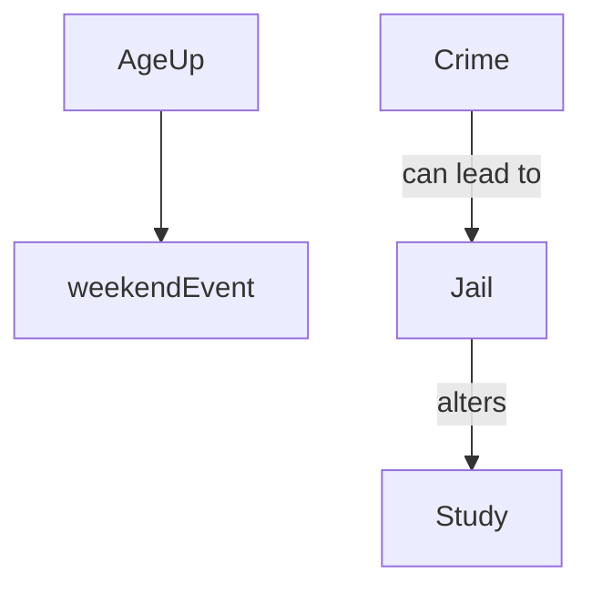

# Actions Overview

## Summary

| Action | Primary Inputs | Primary Outputs |
| --- | --- | --- |
| Age Up | Age, job status, health, jail status | Advances year, triggers weekend events, processes job pay, progresses jail time |
| Study | In jail status | +Smarts, +/-Happiness |
| Meditate | None | +Happiness, +Smarts |
| Hit Gym | Money or jail status | +Health, +Happiness; costs money outside jail |
| Work Extra | Job, job performance, happiness | +Money, -Health, -Happiness |
| Retire | Age, job status | Sets retired state and pension |
| See Doctor | Money, sickness | -Money, cures illness or boosts health |
| Crime | Smarts, gang status, parole | +Money or jail time/injury |
| Host Family Gathering | Relationships, happiness | Improves relationship happiness |
| Have Child | Health, happiness | Adds child or twins |
| Spend Time with Child | Child happiness, player happiness | +Child Happiness |
| Spend Time with Spouse | Spouse happiness, player happiness | +Relationship Happiness |
| Argue with Spouse | Spouse happiness, mental health | -Relationship Happiness; possible breakup |
| Spend Time with Sibling | Sibling presence | +Sibling Happiness |
| Sibling Rivalry | Sibling presence | -Sibling Happiness |
| Buy Car | Money | Car added to inventory, -Money |
| Schedule Maintenance | Cars owned, money | Maintains cars or reduces value, -Money |
| Visit Parent | Money, parent health | +Happiness, +Parent Health |
| Renovate Property | Money, property | Starts renovation, -Money, stops rent |
| Join Gang | Random chance | Adds gang membership |
| Leave Gang | Gang membership | Removes gang affiliation |
| Gang Mission | Gang membership, jail status | +Money or injury/jail |
| Weekend Event | None (triggered by Age Up) | Adjusts happiness or health |

## Key Connections

- **Age Up** triggers a **weekend event** each year, offering small boosts or setbacks.
- Committing **crime** may send the player to **jail**, where actions like **study** behave differently.
